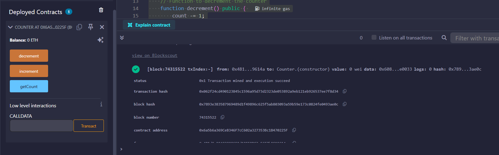
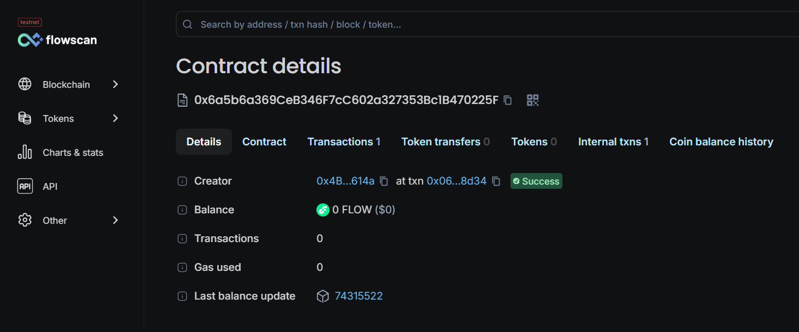

# Counter Smart Contract 🔢



A simple, yet powerful decentralized counter application built on the Flow EVM Testnet. This smart contract demonstrates basic state management and interaction patterns in Solidity.

## 📋 Project Overview

The Counter smart contract is a minimalist decentralized application that allows users to:
- **Increment** the counter value
- **Decrement** the counter value
- **Query** the current counter value

This project serves as a foundational example for understanding smart contract development, deployment, and interaction on the Flow blockchain.

## 🌊 Built on Flow EVM Testnet

Flow EVM provides Ethereum compatibility on Flow's high-performance blockchain, offering:
- Low transaction costs
- Fast finality
- EVM compatibility
- Scalable infrastructure

### Deployment Details

| Property | Value |
|----------|-------|
| **Contract Address** | `0x6a5b6a369CeB346F7cC602a327353Bc1B470225F` |
| **Network** | Flow EVM Testnet |
| **Transaction Hash** | `0x062f24cd490123845c1596a95d73d2323de053892a9eb121eb926537ee7f8d34` |
| **Block Number** | 74315522 |
| **Deployer Address** | `0x4B1d0a004038086F2d18E59DC3e56E7b9C19614a` |
| **Gas Used** | 150,987 gas |
| **Deployment Status** | ✅ Successful |



## 🛠️ Tech Stack

### Smart Contract
- **Solidity** `^0.8.0` - Smart contract programming language
- **MIT License** - Open source licensing

### Blockchain
- **Flow EVM Testnet** - Deployment network
- **EVM Compatible** - Ethereum Virtual Machine support

### Development Tools
- **Remix IDE** - Smart contract development and deployment
- **MetaMask** - Wallet integration and transaction signing
- **Flow EVM RPC** - Network connection

## 📦 Contract Features

### Functions

#### `increment()`
- **Type:** Public
- **Description:** Increases the counter value by 1
- **Gas Cost:** ~26,000 gas (approx.)

#### `decrement()`
- **Type:** Public
- **Description:** Decreases the counter value by 1
- **Gas Cost:** ~26,000 gas (approx.)

#### `getCount()`
- **Type:** Public View
- **Returns:** `int256` - Current counter value
- **Description:** Retrieves the current counter value
- **Gas Cost:** Free (read-only)

## 🚀 Getting Started

### Prerequisites
- MetaMask wallet configured for Flow EVM Testnet
- Test FLOW tokens for gas fees

### Flow EVM Testnet Configuration

Add the following network to your MetaMask:

```
Network Name: Flow EVM Testnet
RPC URL: https://testnet.evm.nodes.onflow.org
Chain ID: 545
Currency Symbol: FLOW
Block Explorer: https://evm-testnet.flowscan.io
```

### Interacting with the Contract

You can interact with the deployed contract using:

1. **Remix IDE**
   - Load the contract at the deployed address
   - Connect to Flow EVM Testnet
   - Call functions through the UI

2. **Web3.js/Ethers.js**
   ```javascript
   const contractAddress = "0x6a5b6a369CeB346F7cC602a327353Bc1B470225F";
   const abi = [...]; // Contract ABI
   const contract = new ethers.Contract(contractAddress, abi, signer);
   
   // Increment counter
   await contract.increment();
   
   // Get current count
   const count = await contract.getCount();
   console.log("Current count:", count.toString());
   ```

3. **Block Explorer**
   - Visit: [Flow EVM Testnet Explorer](https://evm-testnet.flowscan.io)
   - Search for contract: `0x6a5b6a369CeB346F7cC602a327353Bc1B470225F`

## 📊 Project Structure

```
flow/
│
├── counter.sol          # Smart contract source code
└── readme.md           # Project documentation
```

## 🔐 Security Considerations

- ✅ Uses Solidity `^0.8.0` with built-in overflow protection
- ✅ Simple, auditable codebase
- ✅ No external dependencies
- ⚠️ No access control implemented (anyone can modify counter)

## 📈 Future Improvements

### Short-term Enhancements
- [ ] **Access Control**: Implement Ownable pattern to restrict who can modify the counter
- [ ] **Events**: Add event emissions for increment/decrement actions for better tracking
- [ ] **Reset Function**: Add ability to reset counter to zero
- [ ] **Set Function**: Allow setting counter to a specific value
- [ ] **Frontend**: Build a React/Next.js web interface for easier interaction

### Medium-term Goals
- [ ] **Multi-Counter**: Support multiple named counters in a single contract
- [ ] **Counter History**: Store historical counter values with timestamps
- [ ] **Limits**: Add configurable min/max bounds for the counter
- [ ] **Batch Operations**: Allow incrementing/decrementing by custom amounts
- [ ] **Unit Tests**: Add comprehensive test suite using Hardhat/Foundry

### Long-term Vision
- [ ] **Governance**: Implement DAO-style voting for counter modifications
- [ ] **NFT Integration**: Mint NFTs at milestone counter values
- [ ] **Cross-chain**: Deploy to multiple EVM chains
- [ ] **Analytics Dashboard**: Build comprehensive usage analytics
- [ ] **Gas Optimization**: Further optimize contract for lower gas costs

## 📝 License

This project is licensed under the MIT License - see the LICENSE file for details.

## 🤝 Contributing

Contributions are welcome! Feel free to:
- Open issues for bugs or suggestions
- Submit pull requests with improvements
- Share feedback and ideas

## 🔗 Useful Links

- [Flow Documentation](https://developers.flow.com/)
- [Flow EVM Documentation](https://developers.flow.com/evm/about)
- [Solidity Documentation](https://docs.soliditylang.org/)
- [Flow Discord Community](https://discord.gg/flow)

## 👨‍💻 Developer

Developed and deployed by: `0x4B1d0a004038086F2d18E59DC3e56E7b9C19614a`

---

**⭐ If you find this project useful, please consider giving it a star!**

*Built with ❤️ on Flow EVM Testnet*
